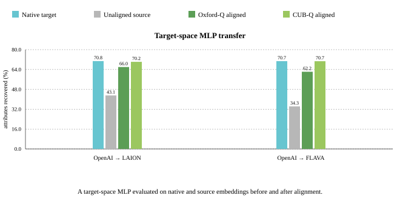
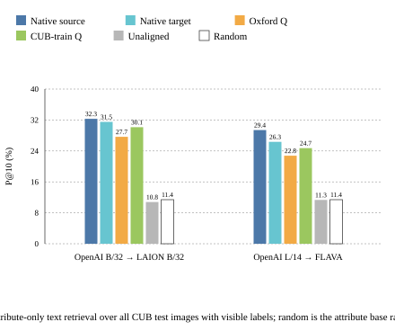

# Finer Multimodal Canonicalization

This project is inspired by Gupta et al., *Canonicalizing Multimodal Contrastive
Representation Learning*. I try to verify whether canonical alignment remains
useful when the evaluation concerns fine visual details.
We study this on **CUB-200-2011**, a fine-grained bird dataset containing
11,788 images from 200 species. Each bird image has 312 visual-attribute labels, such as bill shape, wing color, head color, and tail pattern.

The repository contains two main experiments:

- **Attribute decoder transfer:** train a decoder head to predict bird attributes in one model’s native embedding space, then evaluate the frozen decoder's performance on a second model aligned in the first model's space.
  
  [Decoder-transfer study, along with classification, similarity and retireval analysis](docs/frozen_encoder/README.md)
- **Attribute-guided retrieval:** use an attribute-only text prompt, such as “a bird with a yellow wing,” to retrieve matching CUB images.
  
  [Attribute-Text Image Retrieval under Canonical Alignment](docs/phase2/README.md)

A central result of my analyses is that the orthogonal map derived from the Oxford-IIIT Pets image embeddings, on replicating the paper's methodology, remains effective on CUB’s dense, attribute-level bird annotations, even though it was never fitted to CUB images.  A CUB-specific alignment improves performance further, though, by slight margins on most tasks.

## What the results show



A two-layer MLP is trained in the target
model’s native space to predict each bird’s visible CUB attributes. I then
apply that frozen decoder to source embeddings before and after canonical
alignment. Without alignment, attribute recovery falls sharply; $Q_{\text{Oxford}}$
restores most of the lost performance, while $Q_{\text{CUB-train}}$ nearly reaches the
native target result.



An attribute-only text prompt, such as “a bird
with a yellow wing”, is used to retrieve matching images from the CUB test set.
Attribute-level text-to-image behavior transfers as well: $Q_{\text{Oxford}}$ turns
near-random unaligned cross-model retrieval into a clearly above-baseline
result, while $Q_{\text{CUB-train}}$ improves it further.

[Detailed results and protocols](reports/)

## Repository map

```text
docs/frozen_encoder/              Frozen encoder and decoder-transfer study
docs/phase2/                      Attribute-guided retrieval study
reports/                          Detailed results and protocols
artifacts/                        Compact machine-readable results
configs/                          Locked experiment configurations
src/canonical_study/              Alignment, evaluation, and decoder code
scripts/                          Reproducible launchers and figure rendering
tests/                            Alignment, metric, decoder, and regression tests
```

Downloaded datasets, model weights, large embedding caches, and per-image
prediction dumps are intentionally kept out of the exportable repository.

## Reproduce

```bash
./scripts/bootstrap.sh
.venv/bin/python -m unittest discover -s tests -v
./scripts/run_attribute_text_global_retrieval.sh
python3 scripts/render_phase1_figures.py
python3 scripts/render_attribute_text_retrieval_figures.py
```
