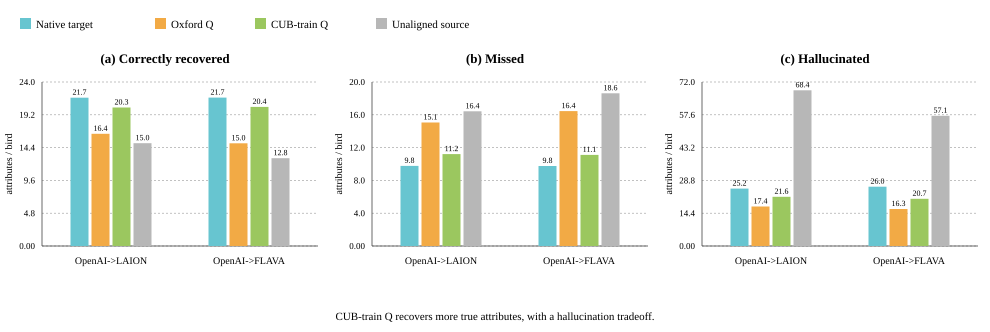
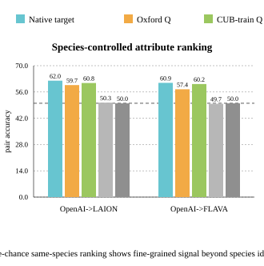
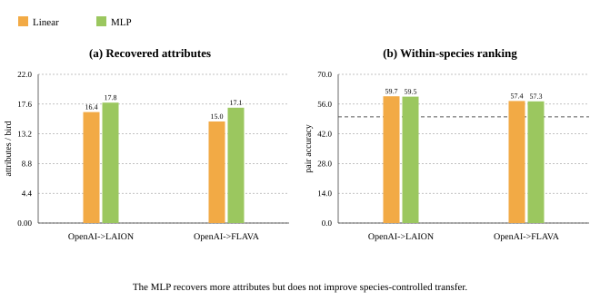

# Phase I: Frozen Encoder Fine-Grained Canonicalization

Gupta et al. show that independently trained multimodal contrastive encoders
can often be connected by a centered orthogonal map. Phase I asks a more
functional question:

> If we train a fine-grained bird-attribute decoder only in model \(B\)'s
> native representation space, can we reuse it on model \(A\)'s embeddings
> after applying the learned orthogonal map?

The answer is yes, but with an important boundary: the transferred structure
is strong and species-controlled, while the extra nonlinear discrimination
captured by a small MLP does not transfer better than a linear readout.

## Experimental frame

We evaluate two frozen model pairs:

- OpenAI CLIP ViT-B/32 → LAION CLIP ViT-B/32.
- OpenAI CLIP ViT-L/14 → FLAVA.

The main zero-shot alignment uses \(Q_{\text{Oxford}}\), fitted on
Oxford-IIIT Pet trainval images and transferred unchanged to CUB-200-2011.
Following the canonicalization paper's cross-dataset protocol, CUB train means
are recomputed before evaluating CUB test examples. The in-domain control
instead fits \(Q_{\text{CUB-train}}\) only on official CUB train images and
evaluates on official CUB test.

No CUB test image is used to fit a map, train a decoder, select an epoch, or
choose thresholds.

## 1. Cosine similarity: do paired embeddings occupy the same coordinates?

Paired cosine compares the same CUB image or class text encoded by the source
and target models. Before alignment, cross-model cosine is near zero. After
alignment, the same object has a much more similar coordinate description.


The CUB-train-fitted map is an in-domain ceiling/control, so it improves image
cosine sharply. The more interesting Oxford result is that a map fitted on pet
images still gives strong CUB image and text alignment.

## 2. Classification and retrieval: does the geometry support semantic reuse?

Image-image retrieval asks whether each source-side image retrieves its paired
target-side image. Joint zero-shot species classification maps both source
images and source text prompts before doing the paper-style class-name
classification, and is shown against native source and native target zero-shot
accuracy.


The in-domain CUB map nearly closes image-image retrieval, especially for
FLAVA. Species classification changes only slightly, which is useful: the
control is not simply making every semantic metric go up. It mostly improves
paired image geometry.

## 3. Fine-grained readout transfer: can the target decoder be reused?

The decoder predicts CUB's visible binary bird attributes. We report the
counts that are easiest to reason about per bird:

- Recovered: visible true attributes predicted present.
- Missed: visible true attributes predicted absent.
- Hallucinated: visible absent attributes predicted present.

True negatives are omitted because there are many of them and they make the
problem look easier than it is.



The Oxford-aligned decoder recovers fewer attributes than the native target
decoder, but it is far less pathological than the unaligned control. Fitting
the rotation on CUB train recovers roughly four to five additional true
attributes per bird, while also hallucinating more. That tradeoff is exactly
why the next metric matters.

## 4. Species-controlled signal: is this more than bird identity?

Within-species ranking compares positive and negative birds of the same
species for the same attribute. If the decoder only knows the species, it gets
50%. Chance and the species-only baseline are therefore both 50%.



Both Oxford-aligned decoders are well above 50%, so the transferred signal is
not just “this species usually has a red crown.” The aligned representation
retains image-specific, within-species visual variation.

## 5. Decoder capacity control: does a stronger readout transfer better?

We also train one prespecified MLP:

```text
Linear(d,512) → GELU → Dropout(0.1) → Linear(512,312)
```

The MLP is trained only on native target CUB embeddings. It is never selected
using aligned-source examples.



The MLP gives a small native-target gain, so the capacity comparison is not
vacuous. But that gain does not survive alignment in the species-controlled
metric. The clean interpretation is:

> Orthogonal alignment transfers fine-grained structure that is largely
> linearly accessible; the extra nonlinear discrimination learned by this MLP
> is not more coordinate-compatible after alignment.

## Compact takeaways

1. Orthogonal alignment learned on Oxford Pets transfers to fine-grained CUB
   bird geometry.
2. A target-space attribute decoder remains useful on aligned source
   embeddings without seeing aligned examples during training.
3. The transferred attribute signal survives a within-species control.
4. CUB-train-fitted alignment substantially improves decoder transfer, but it
   does not make aligned readouts fully native.
5. A stronger MLP readout does not establish stronger nonlinear transfer.

For complete numerical tables and artifact provenance, see
[the detailed Phase I report](../../reports/phase1_results.md) and
[the CUB-train-Q control report](../../reports/cub_train_q_control.md).
