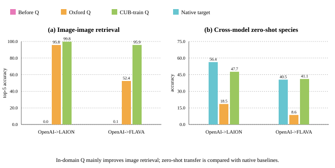

# I: Frozen-Encoder Transfer under Canonical Alignment


> If we train a fine-grained bird-attribute decoder only in model $B$'s
> native representation space, can we reuse it on model $A$'s embeddings
> after applying the learned orthogonal map?
> 
## Experimental frame

We evaluate two frozen model pairs:

- OpenAI CLIP ViT-B/32 → LAION CLIP ViT-B/32.
- OpenAI CLIP ViT-L/14 → FLAVA.

The main zero-shot alignment uses $Q_{\text{Oxford}}$, reproduced from the paper's setup, fitted on
Oxford-IIIT Pet trainval images and transferred unchanged to CUB-200-2011.
Following the paper's cross-dataset protocol, CUB train means
are recomputed before evaluating CUB test examples. 
The in-domain alignment fits $Q_{\text{CUB-train}}$ only on official CUB train images and
evaluates on official CUB test.


## 1. Cosine similarity: do paired embeddings occupy the same coordinates?

Paired cosine compares the same CUB image or class text encoded by the source
and target models. Before alignment, cross-model cosine is near zero. After
alignment, the same object has a much more similar coordinate description.


Both, the $Q_{\text{CUB-train}}$ and $Q_{\text{Oxford}}$ transforms show strong image-image and text-text imlignment.

## 2. Classification and retrieval: does the geometry support semantic reuse?

Image-image retrieval asks whether each source-side image finds its exact
paired target-side image among its five nearest neighbors. $Q_{\text{CUB-train}}$ nearly closes paired image retrieval.



Cross-model zero-shot species classification maps source images into the target space and
classifies them according to target model's native class-name prompts. The
native target bar is the reference for the target model's own classifier. $Q_{\text{CUB-train}}$ aligned classification clearly outperforms $Q_{\text{Oxford}}$, and is comparable to native model classifiers. 

## 3. Fine-grained attribute transfer in both directions

Each decoder predicts CUB's visible bird attributes from an image embedding.
I train one decoder in each model's native space, then feed the aligned image embeddings from the other model into the decoder and evaluate the decoder's results. I use the same orthogonal transform in both directions: source to target uses $Q$, while target to source uses
$Q^\top$. The metric is the mean percentage of each bird's visible-positive
ground-truth attributes that the decoder recovers.

The follow-up decoder is a two-hidden-layer MLP:

```text
Linear(d, 512) → GELU → Dropout(0.1) → Linear(512, 256)
→ GELU → Dropout(0.1) → Linear(256, 312)
```

<p align="center">
  
  
</p>

The full results for both model pairs are in the
[bidirectional decoder-transfer report](../../reports/bidirectional_decoder_transfer.md).


## Compact takeaways

1. Orthogonal alignment learned on Oxford Pets transfers to fine-grained CUB
   bird geometry.
2. Independently trained source and target attribute decoders both remain
   useful after applying $Q$ or $Q^\top$.
4. CUB-train-fitted alignment improves transfer, but it does not make aligned
   decoding fully native.

For complete numerical tables and artifact provenance, see
[the detailed Phase I report](../../reports/phase1_results.md) and
[the CUB-train-Q control report](../../reports/cub_train_q_control.md). For
retrieval numbers, see
[the fine-grained retrieval report](../../reports/fine_grained_retrieval.md).
