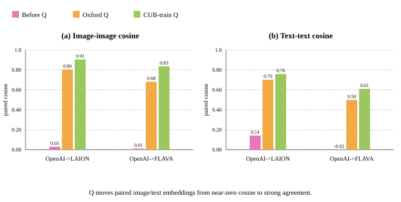
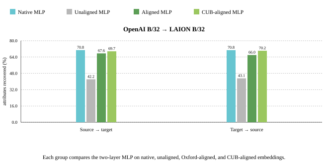
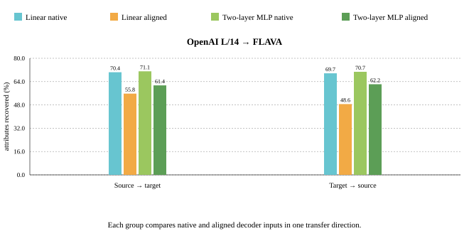
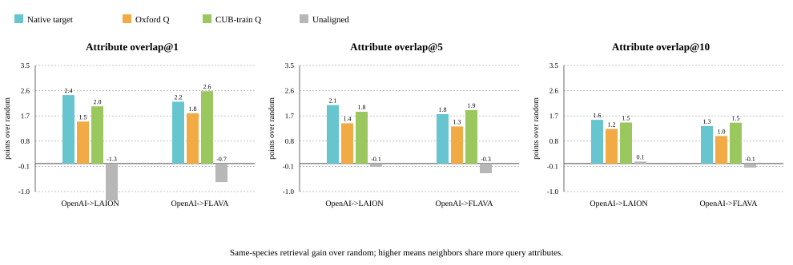
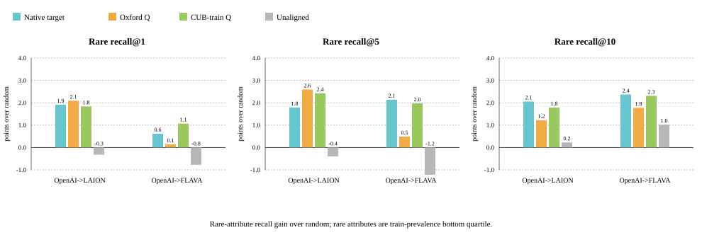

# Phase I: Frozen Encoder Fine-Grained Canonicalization


> If we train a fine-grained bird-attribute decoder only in model $B$'s
> native representation space, can we reuse it on model $A$'s embeddings
> after applying the learned orthogonal map?
> 
## Experimental frame

We evaluate two frozen model pairs:

- OpenAI CLIP ViT-B/32 → LAION CLIP ViT-B/32.
- OpenAI CLIP ViT-L/14 → FLAVA.

The main zero-shot alignment uses $Q_{\text{Oxford}}$, reproduced from the paper's setup, fitted on
Oxford-IIIT Pet trainval images and transferred unchanged to CUB-200-2011.
Following the paper's cross-dataset protocol, CUB train means
are recomputed before evaluating CUB test examples. 
The in-domain alignment fits $Q_{\text{CUB-train}}$ only on official CUB train images and
evaluates on official CUB test.


## 1. Cosine similarity: do paired embeddings occupy the same coordinates?

Paired cosine compares the same CUB image or class text encoded by the source
and target models. Before alignment, cross-model cosine is near zero. After
alignment, the same object has a much more similar coordinate description.



Both, the $Q_{\text{CUB-train}}$ and $Q_{\text{Oxford}}$ transforms show strong image-image and text-text imlignment.

## 2. Classification and retrieval: does the geometry support semantic reuse?

Image-image retrieval asks whether each source-side image retrieves its paired
target-side image. Joint zero-shot species classification maps both source
images and source text prompts before doing the paper-style class-name
classification, and is shown against native source and native target zero-shot
accuracy.


The in-domain CUB map nearly closes image-image retrieval, especially for
FLAVA. Species classification changes only slightly, which is useful: the
control is not simply making every semantic metric go up. It mostly improves
paired image geometry.

## 3. Fine-grained attribute transfer in both directions

Each decoder predicts CUB's visible bird attributes from an image embedding.
We train one decoder in each model's native space, then use the same Oxford
map in both directions: source to target uses $Q$, while target to source uses
$Q^\top$. The metric is the mean percentage of each bird's visible-positive
ground-truth attributes that the decoder recovers.

The follow-up decoder is a two-hidden-layer MLP:

```text
Linear(d, 512) → GELU → Dropout(0.1) → Linear(512, 256)
→ GELU → Dropout(0.1) → Linear(256, 312)
```

<p align="center">
  
  
</p>

Each group contains the same MLP evaluated on native, unaligned, Oxford-aligned,
and CUB-aligned embeddings. The two aligned bars isolate cross-dataset versus
in-domain canonical alignment; the full results for both model pairs are in the
[bidirectional decoder-transfer report](../../reports/bidirectional_decoder_transfer.md).

> **Protocol note.** The two-layer MLP is a follow-up capacity probe using the
> same frozen caches, data split, seeds, and loss, but its early stopping and
> threshold implementation have not yet been folded into the locked Phase I
> protocol. Treat the magnitude of its improvement as preliminary.

## 4. Fine-grained retrieval: do neighborhoods transfer?

The decoder experiment tests reusable readouts. The retrieval extension removes
the decoder and asks whether aligned source embeddings retrieve target-space
birds with matching attributes. Candidate pools are restricted to the same
species and exclude the query image, so coarse class identity is not enough.





Random same-species retrieval is already strong because birds of the same
species share many typical attributes. The aligned conditions therefore matter
most as gain over random and unaligned source. Oxford-Q remains competitive,
while CUB-train-Q is strongest for strict top-1 overlap, matching its role as
an in-domain image-geometry control.

## Compact takeaways

1. Orthogonal alignment learned on Oxford Pets transfers to fine-grained CUB
   bird geometry.
2. Independently trained source and target attribute decoders both remain
   useful after applying $Q$ or $Q^\top$.
3. The two-layer MLP capacity probe retains more visible attributes after
   alignment, although its comparison is preliminary.
4. CUB-train-fitted alignment improves transfer, but it does not make aligned
   decoding fully native.
5. Same-species retrieval shows that alignment also preserves fine-grained
   neighborhood structure, not only decoder compatibility.

For complete numerical tables and artifact provenance, see
[the detailed Phase I report](../../reports/phase1_results.md) and
[the CUB-train-Q control report](../../reports/cub_train_q_control.md). For
retrieval numbers, see
[the fine-grained retrieval report](../../reports/fine_grained_retrieval.md).
