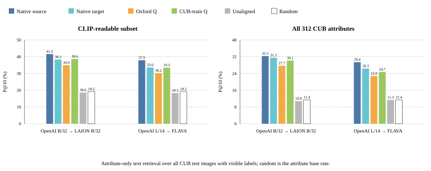
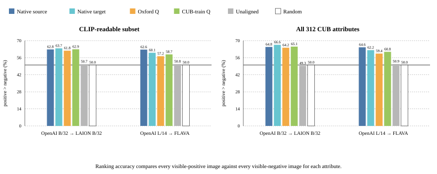

# Phase II: Attribute-Guided Retrieval

This experiment asks whether attribute-only text prompts retrieve CUB birds that
visibly have the queried attribute, and whether that behavior survives
orthogonal alignment across model spaces.

The prompt template is:

```text
a photo of a bird with {attribute phrase}.
```

For each attribute, candidates are all official CUB test images where that
attribute is visible. Positives and negatives are positive and negative images for the queried
attribute respectively.

## What is reported

Two attribute sets are reported:

- **CLIP-readable subset:** 95 pre-specified attributes with ordinary visual
  phrases such as `white belly`, `black bill`, `striped wing`, and `long wings`.
- **All CUB attributes:** all 312 raw CUB attributes, including noisier
  annotation terms such as `primary color`, `upper tail`, and rare/obscure
  color words.

Two metrics are emphasized:

- **P@10:** among the top 10 retrieved images, how many are visible-positive for
  the queried attribute?
- **Ranking accuracy:** how often does the prompt score a visible-positive image
  above a visible-negative image? Chance is 50%.

The random baseline for P@k is the attribute base rate: if 19% of visible
candidate images have the attribute, random P@1/P@5/P@10 is 19% in expectation.

## P@10 retrieval purity



| Pair | Attribute set | Random | Native source | Native target | Unaligned | Oxford-Q | CUB-train-Q |
| --- | --- | ---: | ---: | ---: | ---: | ---: | ---: |
| OpenAI B/32 → LAION B/32 | CLIP-readable | 19.19 | 41.58 | 38.32 | 18.63 | 34.95 | 38.63 |
| OpenAI B/32 → LAION B/32 | All 312 | 11.40 | 32.31 | 31.51 | 10.80 | 27.66 | 30.13 |
| OpenAI L/14 → FLAVA | CLIP-readable | 19.19 | 37.89 | 33.58 | 18.32 | 30.21 | 33.47 |
| OpenAI L/14 → FLAVA | All 312 | 11.40 | 29.39 | 26.35 | 11.31 | 22.76 | 24.71 |

## Positive-versus-negative ranking



| Pair | Attribute set | Random | Native source | Native target | Unaligned | Oxford-Q | CUB-train-Q |
| --- | --- | ---: | ---: | ---: | ---: | ---: | ---: |
| OpenAI B/32 → LAION B/32 | CLIP-readable | 50.00 | 62.82 | 63.71 | 50.73 | 61.79 | 62.91 |
| OpenAI B/32 → LAION B/32 | All 312 | 50.00 | 64.84 | 66.57 | 49.32 | 64.23 | 65.13 |
| OpenAI L/14 → FLAVA | CLIP-readable | 50.00 | 62.63 | 60.06 | 50.78 | 57.22 | 58.72 |
| OpenAI L/14 → FLAVA | All 312 | 50.00 | 64.56 | 62.20 | 50.86 | 59.37 | 60.84 |

## Interpretation

The unaligned source-to-target condition is essentially random: P@10 falls back
to the base rate and ranking accuracy sits near 50%. Applying an orthogonal map
recovers most of the native text-image retrieval signal.

The CUB-train-fitted map is consistently stronger than the Oxford-fitted map,
especially for P@10. On the CLIP-readable subset, CUB-train-Q reaches 38.63%
P@10 for OpenAI B/32 → LAION B/32, compared with 19.19% random and 38.32%
native target. For OpenAI L/14 → FLAVA, CUB-train-Q reaches 33.47% P@10,
close to the 33.58% native target result.

The full 312-attribute benchmark is noisier in raw P@10 because many CUB
attributes are not natural text prompts. Even there, aligned retrieval remains
well above random and far above the unaligned control.

## Reproduce

```bash
PYTHONPATH=src python3 -m canonical_study audit-cub-attribute-prompts \
  --data-root artifacts/data/cub \
  --output-root artifacts/results/attribute_text_retrieval \
  --manifest-min-positive 5 \
  --manifest-min-negative 5
./scripts/run_attribute_text_global_retrieval.sh --force
./scripts/render_attribute_text_retrieval_figures.py
```

Detailed artifact provenance is in
[the attribute-text retrieval report](../../reports/attribute_text_retrieval.md).
